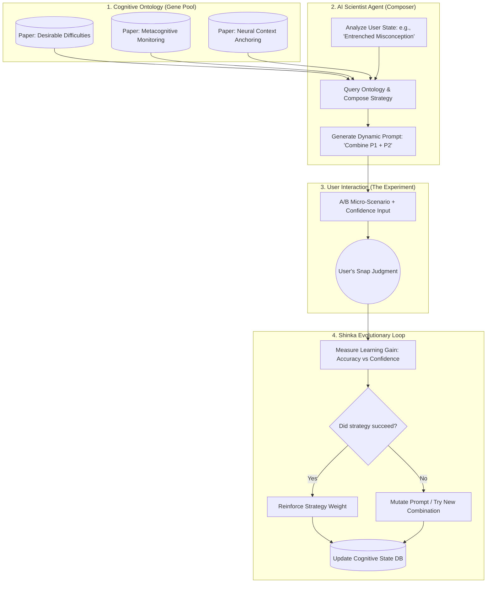

# 🧠 LatentSense

> **Downloading AI's pattern recognition into human intuition.**  
> An evolutionary cognitive architecture that dynamically composes learning strategies from scientific literature to hack neuroplasticity and build expert intuition.

[](LICENSE)
[]()
[]()
[-green)]()

---

## 🌟 The Vision: From Static Tools to Evolutionary Learning

Traditional learning apps rely on static, one-size-fits-all algorithms.  
**LatentSense** is different. It is an **Evolutionary Cognitive Engine** inspired by the "AI Scientist" paradigm. 

Instead of hardcoding a single learning method, LatentSense maintains a dynamic ontology of cognitive science and Second Language Acquisition (SLA) research. It acts as an autonomous "Cognitive Architect," dynamically composing, testing, and evolving learning strategies (e.g., Interleaving + Elaborative Interrogation + Metacognitive Monitoring) tailored to your brain's unique response patterns.

We don't just apply known science; we build a system that *discovers* the optimal cognitive intervention for you through continuous evolutionary feedback loops.

---

## 🔬 The Evolutionary Cognitive Architecture

LatentSense operates on a dynamic, three-tier architecture inspired by evolutionary algorithms and autonomous research agents.

### 1. Cognitive Method Ontology (The "Gene Pool")
* **Concept:** A vector-graph database of peer-reviewed cognitive science and SLA papers.
* **Mechanism:** Each "method" (e.g., *Desirable Difficulties, Spaced Repetition, Generation Effect, Neural Context Anchoring*) is stored as a modular "gene" with its defined parameters, target cognitive bias, and expected outcome.

### 2. The AI Scientist Agent (Dynamic Strategy Composer)
* **Concept:** An LLM-based agent that acts as a real-time cognitive architect.
* **Mechanism:** Instead of a fixed quiz, the Agent analyzes your current performance data (the "Environment"). It then queries the Ontology to dynamically compose a learning session. 
  * *Example:* "User is showing 'High Confidence + Wrong' on Russian motion verbs. Hypothesis: Apply 'Discrimination Learning' combined with 'Visual Metaphor Generation' to break the entrenched misconception."

### 3. The "Shinka" Evolutionary Loop (Self-Improving Prompts)
* **Concept:** Continuous optimization of the learning strategies based on empirical user data.
* **Mechanism:** The system tracks the "Learning Gain" (reduction in error rate + increase in confidence) for every strategy combination. Using an evolutionary algorithm (or LLM-based prompt mutation), it "mutates" the A/B generation prompts and "selects" the fittest strategies that yield the highest neuroplastic adaptation for your specific brain.

---

## ⚙️ How the Dynamic Loop Works



1. **State Analysis:** The system detects a cognitive blind spot (e.g., you keep confusing two similar concepts with high confidence).
2. **Dynamic Composition:** The AI Scientist pulls relevant "method genes" from the literature and crafts a highly specific, one-off A/B testing scenario designed to break that exact misconception.
3. **Execution & Measurement:** You engage with the scenario. The system measures not just accuracy, but the *shift* in your confidence and reaction time.
4. **Evolution:** Successful strategies are reinforced for your profile. Failed strategies trigger prompt mutation, constantly evolving the system to find *your* optimal learning path.

---

## 🌍 Domain-Agnostic Applications

Because the core engine manipulates *pattern recognition* and *cognitive load* rather than domain-specific facts, it scales infinitely:

* 🗣️ **Language Acquisition:** Dynamically switching between phonological awareness drills, pragmatic nuance testing, and grammatical intuition based on real-time error patterns.
* 🧮 **Mathematics & Physics:** Generating "Elegance Discrimination" tasks (choosing the most elegant proof) or visual-spatial intuition builders.
* ♟️ **Strategy Games:** Evolving tactical pattern recognition by dynamically adjusting the complexity and deception level of board states.
* 💼 **Professional Skills:** Simulating high-stakes negotiation or UX decision-making with dynamically generated psychological subtext.

---

## 🛠️ Tech Stack (Scalable from Local PoC to Cloud)

* **Core Logic:** Python 3.10+ (LangChain / LlamaIndex for agentic workflows).
* **AI Engine:** Local LLM via **Ollama** (PoC) → Scalable to GPT-4o / Claude 3.5 Opus for complex strategy composition.
* **Knowledge Base:** ChromaDB / Qdrant (Vector DB for paper embeddings) + NetworkX (Graph DB for method relationships).
* **UI/UX:** Streamlit (Rapid prototyping) → Flutter/React Native (Production mobile app with haptic feedback).
* **Database:** SQLite (Local) → PostgreSQL (Scalable user state and evolutionary metrics).

---

## 🚀 Getting Started (Local PoC)

Start by experiencing the core "A/B + Metacognition" loop locally. The evolutionary agent layer can be incrementally added.

### Prerequisites
1. Install [Ollama](https://ollama.com/) and pull a model: `ollama pull qwen2.5`
2. Ensure Python 3.10+ is installed.

### Installation & Run
```bash
git clone https://github.com/yourusername/latentsense.git
cd latentsense
pip install -r requirements.txt
streamlit run app.py
```
*The app connects to your local Ollama instance, establishing the foundational feedback loop.*

---

## 🗺️ Roadmap: The Path to Autonomy

- [x] **Phase 1: Foundation** - Core A/B generation, Local LLM integration, Metacognitive Monitoring (Confidence Tracking).
- [ ] **Phase 2: The Ontology** - Build the Vector/Graph database of cognitive science papers and extract modular "method genes."
- [ ] **Phase 3: The AI Scientist** - Implement the dynamic strategy composer that selects and combines methods based on user state.
- [ ] **Phase 4: Shinka Evolution** - Deploy the automated prompt mutation and selection loop to self-optimize learning strategies.
- [ ] **Phase 5: Multi-Modal Anchoring** - Integrate ambient audio/visual themes (Neural Context Anchoring) dynamically triggered by the Agent.

---

## 🤝 Contributing: Join the Cognitive Revolution

This project sits at the intersection of AI, cognitive science, and software engineering. We need:
* **Researchers:** To help parse and structure cognitive science/SLA papers into the "Method Ontology."
* **Domain Experts:** To define what "expert intuition" looks like in your field (Math, Chess, Medicine, etc.).
* **AI Engineers:** To build the agentic composition and evolutionary prompt optimization loops.

Check out our [Contributing Guidelines](CONTRIBUTING.md) to help evolve the system.

## 📄 License

MIT License. See the [LICENSE](LICENSE) file for details.

