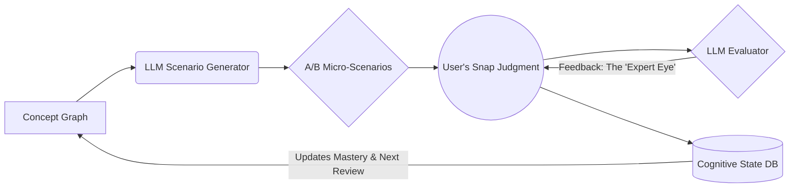

# 🧠 LatentSense

> **Downloading AI's pattern recognition into human intuition.**  
> A domain-agnostic cognitive training engine that builds "expert intuition" via A/B testing and prediction error.

[](LICENSE)
[]()
[]()
[]()

---

## 🌟 The Paradigm Shift: From "Knowing" to "Feeling"

Traditional learning optimizes for **System 2** (slow, logical memorization). You read rules, memorize vocabulary, and solve step-by-step.  
**LatentSense** optimizes for **System 1** (fast, intuitive pattern recognition). 

Grandmasters don't calculate every chess move; they *feel* the right pattern. Native speakers don't conjugate verbs in their heads; they *feel* what sounds right. LatentSense uses the high-dimensional statistical intuition of Large Language Models (LLMs) to train your brain's neural pathways, allowing you to "download" expert intuition directly into your subconscious.

## 🔬 The Science Behind It

LatentSense is not a quiz app. It is a cognitive sandbox built on proven principles of cognitive science and Second Language Acquisition (SLA):

*   **Prediction Error (Rescorla-Wagner Model):** The brain's synaptic weights update most strongly when a prediction is violated. By presenting micro-differences in A/B scenarios, we maximize the "prediction error" when your intuition is wrong, forcing rapid neural rewiring.
*   **Latent Space Alignment:** LLMs possess a deep, statistical understanding of concepts (their "latent space"). We use the LLM to generate scenarios that test the boundaries of this space, effectively using the AI's pattern recognition as the ground truth for human training.
*   **Desirable Difficulties & Interleaving:** We don't block-practice. We mix domains and subtly shift contexts to force your brain to constantly discriminate and adapt, proven to vastly improve long-term retention and transfer.
*   **Spaced Repetition (FSRS):** Concepts are resurfaced exactly at the edge of your forgetting curve.

## ⚙️ How It Works



1.  **Targeted Generation:** The system selects a concept from the knowledge graph (e.g., Russian motion verbs, mathematical elegance, chess positional play).
2.  **A/B Micro-Testing:** The LLM generates two highly similar options. One is subtly more "native," "elegant," or "optimal."
3.  **Snap Judgment:** You choose A or B based purely on gut feeling. No overthinking.
4.  **Expert Feedback:** If you err, the LLM doesn't just give the answer. It explains the *Core Image*, the *rhythm*, or the *hidden signal* that a native expert would instantly recognize.
5.  **State Update:** Your cognitive state is updated, and the next scenario is dynamically adjusted to maintain the `i+1` (optimal difficulty) threshold.

## 🌍 Domain-Agnostic Applications

Because it targets *pattern recognition* rather than specific facts, LatentSense can be applied to any domain requiring expert intuition:

*   🗣️ **Language Acquisition:** Nuance, collocations, pragmatics, and the "feel" of a native speaker.
*   🧮 **Mathematics:** Geometric intuition, recognizing elegant proofs, and choosing the right problem-solving heuristic.
*   ♟️ **Strategy (Chess/Go):** Positional evaluation, recognizing tactical patterns, and assessing board dynamics.
*   💼 **Business & Design:** UX micro-interactions, negotiation tactics, and reading psychological subtext in emails.

## 🛠️ Tech Stack

*   **Backend:** Python, FastAPI (for high-performance async LLM streaming).
*   **AI Engine:** OpenAI API (GPT-4o) / Anthropic API (Claude 3.5) for nuanced scenario generation and evaluation.
*   **Frontend:** React / Next.js (or Flutter for mobile). UI is designed to be minimal and swipe-based (Tinder-like) to encourage rapid, System-1 responses.
*   **Database:** PostgreSQL (User state & FSRS scheduling) + Neo4j (Concept Graph & Ontology mapping).

## 🚀 Getting Started

### Prerequisites
*   Python 3.10+
*   Node.js 18+
*   An API key for OpenAI or Anthropic.

### Installation

1. Clone the repository:
   ```bash
   git clone https://github.com/yourusername/latentsense.git
   cd latentsense
   ```

2. Set up the backend:
   ```bash
   cd backend
   python -m venv venv
   source venv/bin/activate  # On Windows: venv\Scripts\activate
   pip install -r requirements.txt
   cp .env.example .env  # Add your LLM API keys here
   uvicorn main:app --reload
   ```

3. Set up the frontend:
   ```bash
   cd ../frontend
   npm install
   npm run dev
   ```

## 🗺️ Roadmap

- [x] Core A/B generation engine & LLM integration
- [x] Cognitive state tracking (FSRS implementation)
- [ ] Frontend MVP (Swipe-based UI for Web)
- [ ] Domain Plugin System (Allow community to add Math, Chess, etc.)
- [ ] Offline mode with local SLMs (e.g., Llama 3)
- [ ] Multiplayer / Collaborative intuition mapping

## 🤝 Contributing

We are looking for cognitive scientists, language teachers, domain experts (chess players, mathematicians), and developers! 
If you want to design a new "Domain Ontology" or improve the prompt engineering for the LLM evaluator, please check out our [Contributing Guidelines](CONTRIBUTING.md).

## 📄 License

This project is licensed under the MIT License - see the [LICENSE](LICENSE) file for details.
