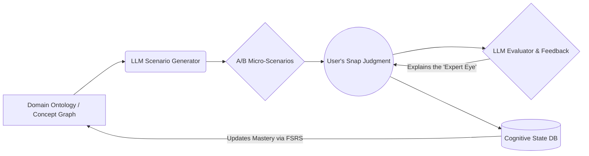

# 🧠 LatentSense

> **Downloading AI's pattern recognition into human intuition.**  
> A domain-agnostic cognitive training engine that builds "expert intuition" via A/B micro-testing and prediction error.

[](LICENSE)
[]()
[]()
[_or_Cloud-green)]()

---

## 🌟 The Paradigm Shift: From "Knowing" to "Feeling"

Traditional learning optimizes for **System 2** (slow, logical memorization). You read grammar rules, memorize vocabulary lists, and solve problems step-by-step.  
**LatentSense** optimizes for **System 1** (fast, intuitive pattern recognition). 

Chess grandmasters don't calculate every possible move; they *feel* the right pattern. Native speakers don't mentally conjugate verbs; they *feel* what sounds right. LatentSense leverages the high-dimensional statistical intuition of Large Language Models (LLMs) to train your brain's neural pathways, allowing you to "download" expert-level pattern recognition directly into your subconscious.

---

## 🔬 The Science & AI Architecture Behind It

LatentSense is not a quiz app. It is a cognitive sandbox designed by mapping **human cognitive learning mechanisms** directly onto **AI training methodologies**.

### 1. Prediction Error as "Human Backpropagation"
*   **Cognitive Science:** According to the Rescorla-Wagner model, the brain's synaptic weights update most strongly when a prediction is violated (Prediction Error). 
*   **AI Parallel:** This is the exact biological equivalent of **Backpropagation** in neural networks. 
*   **Our Design:** By presenting A/B scenarios with *micro-differences*, we intentionally trigger a prediction error when your gut feeling is wrong. The immediate, high-quality feedback acts as the "error signal," forcing rapid neural rewiring and updating your internal "weights."

### 2. Latent Space Distillation (Pattern Recognition Transfer)
*   **Cognitive Science:** Experts use "chunking" to recognize complex patterns instantly, bypassing slow logical deduction.
*   **AI Parallel:** LLMs navigate a high-dimensional "latent space" where concepts are mapped by statistical probability and co-occurrence.
*   **Our Design:** We use the LLM not just as a text generator, but as an "Expert Oracle." It generates scenarios that test the boundaries of its latent space, effectively distilling the AI's statistical pattern recognition into human-understandable "Core Images" and "Rhythms."

### 3. Discrimination Learning via Desirable Difficulties
*   **Cognitive Science:** Robert Bjork's "Desirable Difficulties" and "Interleaving" prove that mixing contexts and forcing discrimination between highly similar concepts vastly improves long-term retention and transfer, compared to blocked practice.
*   **Our Design:** The system avoids obvious right/wrong questions. It forces you to discriminate between two *plausible* options, maximizing the cognitive load exactly where it builds true intuition.

### 4. Spaced Repetition (FSRS)
*   Concepts are resurfaced dynamically at the edge of your forgetting curve, ensuring that the newly formed intuitive pathways are consolidated into long-term memory.

---

## ⚙️ How It Works



1. **Targeted Generation:** The system selects a concept (e.g., Russian motion verb prefixes, mathematical proof elegance, chess positional play).
2. **A/B Micro-Testing:** The LLM generates two highly similar options. One is subtly more "native," "elegant," or "optimal."
3. **Snap Judgment:** You choose A or B based purely on gut feeling. No overthinking allowed.
4. **Expert Feedback:** If you err, the LLM doesn't just give the answer. It explains the *Core Image*, the *rhythm*, or the *hidden signal* that a native expert would instantly recognize, bridging the gap between your error and the correct pattern.
5. **State Update:** Your cognitive state is updated, and the next scenario is dynamically adjusted to maintain the `i+1` (optimal difficulty) threshold.

---

## 🌍 Domain-Agnostic Applications

Because it targets *pattern recognition* rather than specific facts, LatentSense can be applied to any domain requiring expert intuition:

*   🗣️ **Language Acquisition:** Nuance, collocations, pragmatics, and the "feel" of a native speaker.
*   🧮 **Mathematics:** Geometric intuition, recognizing elegant proofs, and choosing the right problem-solving heuristic.
*   ♟️ **Strategy (Chess/Go):** Positional evaluation, recognizing tactical patterns, and assessing board dynamics.
*   💼 **Business & Design:** UX micro-interactions, negotiation tactics, and reading psychological subtext.

---

## 🛠️ Tech Stack

Designed for rapid iteration and privacy-first local development, while remaining scalable to cloud infrastructure.

*   **Core Logic:** Python 3.10+
*   **UI/UX:** Streamlit (for rapid, minimal, swipe-like A/B testing interfaces without frontend build complexity).
*   **AI Engine:** 
    *   *Local (Recommended for PoC/Privacy):* Ollama (Llama 3, Qwen 2.5)
    *   *Cloud (For advanced nuance):* OpenAI API (GPT-4o) / Anthropic API (Claude 3.5)
*   **Database:** SQLite (Local user state & FSRS scheduling) / PostgreSQL (Scalable deployment).

---

## 🚀 Getting Started (Local PoC)

The easiest way to experience LatentSense is to run it locally with Ollama. No API keys or cloud dependencies required.

### Prerequisites
1. Install [Ollama](https://ollama.com/) and pull a model: `ollama pull qwen2.5` (or `llama3.1`)
2. Install Python 3.10+

### Installation & Run

1. Clone the repository:
   ```bash
   git clone https://github.com/yourusername/latentsense.git
   cd latentsense
   ```

2. Install dependencies:
   ```bash
   pip install -r requirements.txt
   ```

3. Run the Streamlit app:
   ```bash
   streamlit run app.py
   ```
   *The app will automatically connect to your local Ollama instance at `http://localhost:11434`.*

---

## 🗺️ Roadmap

- [x] Core A/B generation engine & LLM integration
- [x] Local LLM (Ollama) PoC with robust JSON error handling
- [x] Cognitive state tracking (FSRS implementation)
- [ ] Frontend MVP (Mobile-friendly swipe UI via Streamlit or Flutter)
- [ ] Domain Plugin System (Allow community to add Math, Chess, etc.)
- [ ] Multiplayer / Collaborative intuition mapping

---

## 🤝 Contributing

We are looking for cognitive scientists, language teachers, domain experts (chess players, mathematicians), and developers! 
If you want to design a new "Domain Ontology" or improve the prompt engineering for the LLM evaluator, please check out our [Contributing Guidelines](CONTRIBUTING.md).

## 📄 License

This project is licensed under the MIT License - see the [LICENSE](LICENSE) file for details.

