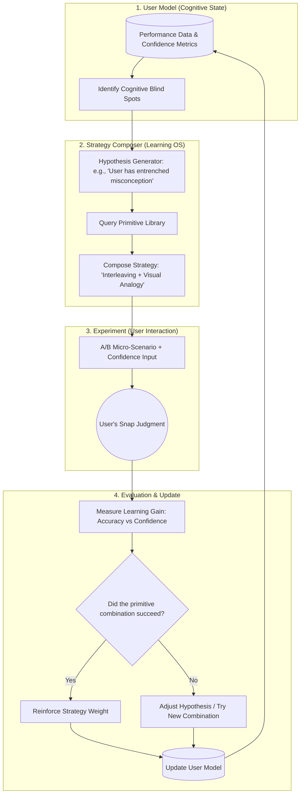

# 🧠 LatentSense

> **A Learning Operating System for Composable Cognitive Primitives.**  
> Dynamically composing evidence-based learning strategies to download AI's pattern recognition into human intuition.

[](LICENSE)
[]()
[]()
[-green)]()

---

## 🌟 The Vision: From Static Quizzes to a Learning OS

Traditional learning apps apply a single, static algorithm to all users.  
**LatentSense** is designed as a **Learning Operating System**. 

Instead of hardcoding a single learning method, LatentSense treats evidence-based cognitive interventions (e.g., *Interleaving, Generation Effect, Metacognitive Monitoring*) as **Composable Learning Primitives**. 

The system dynamically combines these primitives based on the user's real-time cognitive state. **The AI does not evolve; the user's internal cognitive model evolves.** By continuously testing hypotheses about how the user learns best, LatentSense acts as an adaptive engine that optimizes the transfer of AI's statistical pattern recognition into human intuition.

---

## 🔬 Core Concept: Composable Learning Primitives

LatentSense abstracts learning methods into modular "primitives" (or "method genes"). 

```json
{
  "primitive_id": "desirable_difficulties_interleaving",
  "target_bias": "Illusion of competence",
  "composition_rule": "Mix 20% of conceptually adjacent items into the current A/B test."
}
```

Examples of primitives include:
*   **Retrieval & Generation:** Forcing the brain to actively search for an answer before it is revealed.
*   **Interleaving & Discrimination:** Mixing similar concepts to force the brain to identify boundary conditions.
*   **Metacognitive Monitoring:** Cross-referencing objective accuracy with subjective confidence to identify "blind spots."
*   **Visual Analogy:** Distilling abstract statistical differences into spatial or visual metaphors.

The **Learning OS** analyzes the user's performance and dynamically "programs" a learning session by chaining these primitives together (e.g., *Generation → Interleaving → Confidence Reflection*).

---

## ⚙️ Architecture: The Adaptive Learning Loop

LatentSense operates on a continuous feedback loop focused on refining the **User Model**.



1. **State Analysis:** The system detects a cognitive blind spot (e.g., *High Confidence + Wrong*).
2. **Dynamic Composition:** The OS selects and combines primitives from the library to target that specific misconception.
3. **Execution:** The user engages with the dynamically generated A/B scenario.
4. **Model Update:** The system measures the effectiveness of the intervention and updates the User Model, refining future strategy selections.

---

## 🌍 Domain-Agnostic Applications

Because the core engine manipulates *cognitive primitives* rather than domain-specific facts, it scales infinitely:

* 🗣️ **Language Acquisition:** Nuance, collocations, and the "feel" of a native speaker.
* 🧮 **Mathematics:** Geometric intuition and recognizing elegant proofs.
* ♟️ **Strategy Games:** Positional evaluation and tactical pattern recognition.
* 💼 **Professional Skills:** Reading psychological subtext and UX decision-making.

---

## 🛠️ Tech Stack & Current Implementation Status

### Phase 1: Foundation (Implemented / Local PoC)
*   **Core Logic:** Python 3.10+
*   **UI/UX:** Streamlit (Minimal, swipe-like A/B testing interface).
*   **AI Engine:** Local LLM via **Ollama** (Llama 3 / Qwen 2.5) for zero-cost, privacy-first scenario generation.
*   **Primitives Implemented:** A/B Micro-testing, Metacognitive Monitoring (Confidence Tracking), Visual Analogy Generation.

### Phase 2: The Learning OS (Research Hypothesis / In Progress)
*   **Primitive Ontology:** Building a structured library of composable cognitive primitives with defined parameters and success metrics.
*   **Adaptive Composer:** Implementing the logic to dynamically chain primitives based on the User Model.
*   **Database:** SQLite (Local) → PostgreSQL (Scalable user state and evolutionary metrics).

---

## 🚀 Getting Started (Local PoC)

Experience the foundational "A/B + Metacognition" loop locally.

### Prerequisites
1. Install [Ollama](https://ollama.com/) and pull a model: `ollama pull qwen2.5`
2. Ensure Python 3.10+ is installed.

### Installation & Run
```bash
git clone https://github.com/yourusername/latentsense.git
cd latentsense
pip install -r requirements.txt
streamlit run app.py
```

---

## 🗺️ Roadmap: Towards a Learning OS

- [x] **Phase 1:** Core A/B generation, Local LLM integration, Metacognitive Monitoring.
- [ ] **Phase 2:** Define and implement the "Composable Learning Primitives" library.
- [ ] **Phase 3:** Build the Adaptive Strategy Composer (The Learning OS core).
- [ ] **Phase 4:** Multi-Modal Anchoring (Dynamic ambient audio/visual themes).
- [ ] **Phase 5:** Open API for researchers to plug in new cognitive primitives and test them at scale.

---

## 🤝 Contributing: Join the Cognitive Revolution

This project sits at the intersection of AI, cognitive science, and software engineering. We need:
* **Researchers:** To help define and validate new "Composable Learning Primitives."
* **Domain Experts:** To define what "expert intuition" looks like in your field.
* **AI Engineers:** To build the adaptive composition logic and user modeling.

Check out our [Contributing Guidelines](CONTRIBUTING.md) to help build the Learning OS.

## 📄 License

MIT License. See the [LICENSE](LICENSE) file for details.

成させるか、どちらに進めましょうか？
